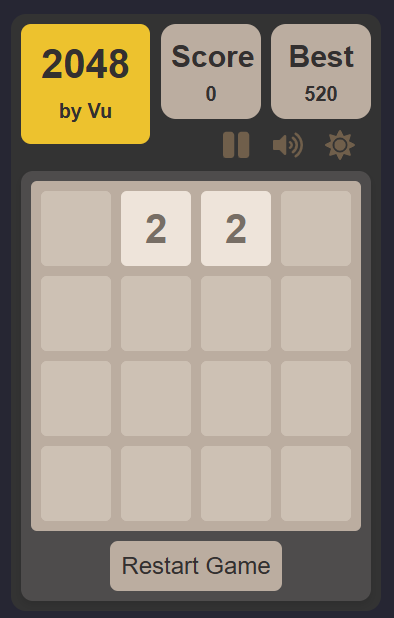

# 2048-Game-VU-NGUYEN

This repository is reserved only for the assessment interview of Qlik and self-learning. It is a web-based implementation of the classic _2048 game_, built with React. It features a clean interface, smooth animation and several other features.
The game is deployed on Netlify (from this repository) at [link-to-deployment](https://vuqlik-2048.netlify.app/)



## Included features

- Classic 2048 Gameplay: 4x4 grid where you slide and merge tiles.
  - Move tiles when player presses arrow keys (prevent scrolling)
  - Generate new tiles for every turn. Merge two colliding tiles into one
  - Depending on the values, a tile has different color (up to 2048)
- Win/Loss condition:
  - Win: If the player reaches the 2048 tile, a message is displayed with an option to continue to achieve a higher score or to start a new game.
  - Loss: When the board is full _and_ no more moves are possible
- Score and Best Score: Tracking your current Score and Best Score (saved to `localStorage`)
- Animations/Transitions: Tiles slide and merge smoothly across the board. Merge tiles have "pop" animation, new tiles fade in nicely.
- Touch/mobile support - swipe to move the tiles (prevent scrolling)
- Sound effects: (Optional) sounds for tiles sliding and merging.
- Game Controls:
  - Pause/Resume: Pause the game at anytime
  - Mute/Unmute: Toggle sound effects on or off
  - Restart: Start a new game at any point
  - Dark Mode: A dark theme for comfortable playing in low-light conditions.

## Remaining work-items

Towards Scalability and Maintenance

- Modularisation
  - Extract JSX in App.jsx into Header, Game, Overlay...
  - Extract Game logic in App.jsx
- Responsive display

## Technologies

This project is built with modern web technologies:

- Framework: [React](https://react.dev/)
- Build Tool: [Vite](https://vite.dev/)
- Language: Javascript
- Styling: CSS
- Icons: [react-icons](https://react-icons.github.io/react-icons/)

## Requirements

To run this project locally, you need

- Node.js (v18.x or higher)
- npm

### Installation & Setup

1. **Clone the repository**

```bash
git clone https://github.com/vunguyen95/qlik2048.git
cd qlik2048
```

2.**Install dependencies**

```bash
npm install
```

3. **Run the development server**

```bash
npm run dev
```

## Core logic.

1. Stage Management (`src/App.jsx`)
   - includes game states (`board, score, gameOver...`), managed with React hooks.
   - passes down props to child components `Grid` (`board, onMove, newTile, movementData, mergedTiles`).
   - `useEffect(), useRef()` used for side effects (retrieve best score, initiate sounds, checking game-over, `hasWon`, managing animation timers).
2. Game Mechanics (`src/utils/utility.js`)
   This module contains the pure functions that are behind the game mechanic:s

- `initializeBoard()`: creates an empty 4x4 grid
- `addRandomTile(board)`: finds empty tiles and place a new tile (90% a 2, 10 % a 4)
- `handleMove(direction) (src/App.jsx)`: core functions, triggered by player input, by `onMove(direction)` in `Grid()`.
  - Depending the direction, it iterates through row (`isRow`) or column (`!isRow`), passing to `merge()`.
  - `merge(arr,score,direction)` : is the heart of the game.
    - Originally for `"right` direction. If it is `"left" || "up`, reverse the `arr`.
    - Filters the non-null tiles, performs merging of equal adjacent tiles, updates score
    - returns new values, tracking data: which tiles is merges, `from` and `to` indices for each tiles.
  - The `newBoard`, absolute positional changes (`movementData, allMergedTile`) is computed in `handleMove()`, passed down to `Grid()`.

3. Animation Flow

- is handled in `handleMove()`. Divided into two phases:
  - Sliding phase: `movementData` is set in the state, which triggers the CSS transition. User is disabled with `isAnimating()` flag.
  - Update phase: A `setTimeout`, timed to match animation duration, fires to complete the move. After that, `newBoard, allMergeTiles, newTiles` is set, triggering animation. Also re-enables user input. Animation data is cleared with `useEffect`.
